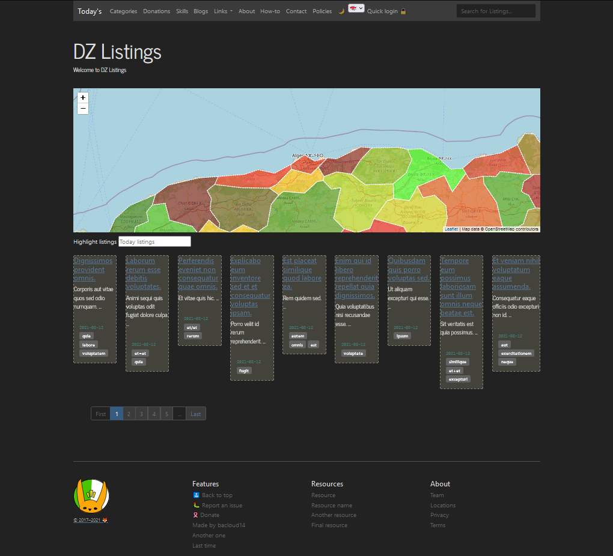
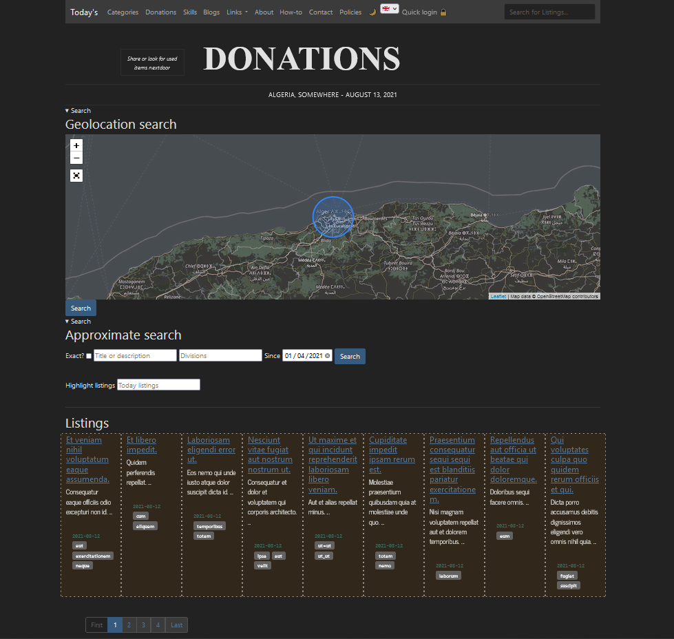
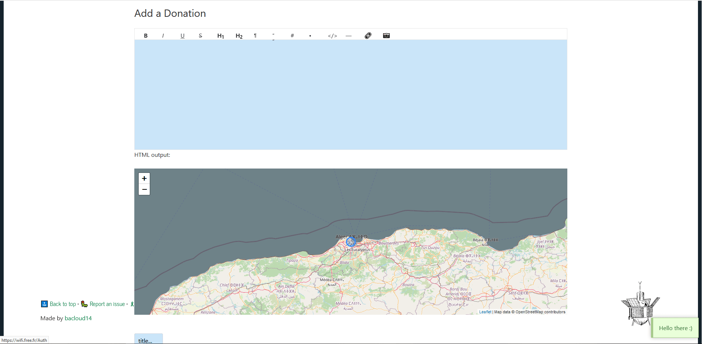
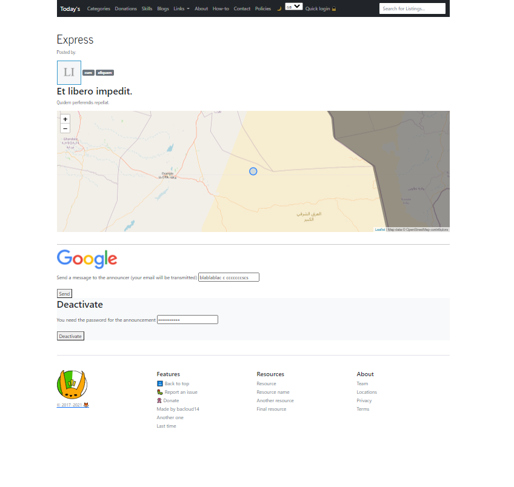

# Classified-ads-48 

Bringing to the web the idea of classified advertising. Together with rich input forms and an interactive map, we hope to create a digital platform that scales for different categories (sections) and for a large load of accessing users. All with a simple navigation, minimal subscription and respecting user privacy.

## Inspired from newspapers

> Newspaper classifieds  
Advertisements in a newspaper are typically short, as they are charged for by the line or word, and are one newspaper column wide.  
Publications printing news or other information often have sections of classified advertisements; there are also publications that contain only advertisements. The advertisements are grouped into categories or classes such as "for sale—telephones", "wanted—kitchen appliances", and "services—plumbing", hence the term "classified". Classified ads generally fall into two types: individuals advertising sales of their personal goods, and advertisements by local businesses. Some businesses use classified ads to hire new employees. [link to Wikipedia](https://en.wikipedia.org/wiki/Classified_advertising)

--------

In **Classified-ads-48** however (this repository), users can post in the following sections:

- Donations (main section of the website)
- Skills 
- Articles: DIY, How-Tos, passions, passtimes and hobbies

and the map that I chose is *Algeria*. 

The purpose of this project is to let forkers implement new sections and offer the wep-app for other geo-locations.

**Classified-ads-48** utilizes many front and back-end libraries to offer a rich set of form, users can post HTML styled articles with pictures.

**Classified-ads-48** respects user privacy and offers a passwordless login.

**Classified-ads-48** acts like a Man In the Middle to offer messaging between users. Without a heavy messaging system like internal messages box. It rather let users use their respective emails.

## JavaScript libraries and credits

**Classified-ads-48** utilizes **a lot** of beautiful and effective libraries besides server npm packages, these are the libraries and snippets used for front-end (descriptions from their respective repositories):

 - pell: the simplest and smallest WYSIWYG text editor for web, with no dependencies [repo](https://github.com/jaredreich/pell)
 - tagify: lightweight, efficient Tags input component in Vanilla JS / React / Angular / Vue [repo](https://github.com/yairEO/tagify)
 - toasty: A minimal JavaScript notification plugin that provides a simple way to display customizable toast messages on the web page with CSS3 transition effects. [repo](https://github.com/egalink/Toasty.js)
 - holmes: Fast and easy searching inside a page [repo](https://github.com/Haroenv/holmes) It uses microlight also.
 - auto-complete:  An extremely lightweight and powerful vanilla JavaScript completion suggester. [repo](https://github.com/Pixabay/JavaScript-autoComplete)
 - jsi18n: Simple client side internationalization with javascript. [repo](https://github.com/danabr/jsI18n) 
 - avatar: Library for showing Gravatars or generating user avatars. [repo](https://github.com/MatthewCallis/avatar) 
 - FontPicker: Font selector component for Google Fonts . [repo](https://github.com/samuelmeuli/font-picker)
 - stretchy: Form element autosizing, the way it should be. [repo](https://github.com/LeaVerou/stretchy)

 Thanks to all people involved! For backend see the **License** section 

## Database

MongoDB using the official MongoDB Node Driver

## Style

It is inteded to be clean, fast and paper/newspaper looking style and layout.


**Data model is really simplistic. I only used one table (or collection in NoSQL jargon).**

## Routes 

**Note**  
We use *Listings/listing* term as a designation of *posts/post*.

Routes reflect what is possible. See https://github.com/bacloud14/Classified-ads-48/blob/main/routes/listings.js 
Otherwise, this is the list of routes (queries and views):

  - <ins>domain</ins>/listings -> listings.ejs : is for showing some of listings. Also to initiate the following post queries
  - <ins>domain</ins>/listings/{section} -> listings.ejs : is for showing some of listings. but for some section
  - <ins>domain</ins>/listings/gwoogl -> listings.ejs : for search of listings
  - <ins>domain</ins>/listings/add_donation -> listing.ejs : for adding a listing
  - <ins>domain</ins>/listings/add_skill -> listing.ejs : for adding a listing
  - <ins>domain</ins>/listings/deactivate -> messages.ejs : to deactivate a listing
  - <ins>domain</ins>/listings/{some_id} -> listing.ejs : to show a listing of some id
  - <ins>domain</ins>/ -> index.ejs : shows map & exposts all other routes (contact, tags, listings, ...)
  - <ins>domain</ins>/{some_tag} -> listings.ejs : to show all listings about one tag
  - <ins>domain</ins>/{some_division} -> listings.ejs : to show all listings for some geo delimitation
  - <ins>domain</ins>/listings/tags -> tags.ejs : for exposing contant list of possible tags
  - <ins>domain</ins>/contact -> messages.ejs : for user messaging 
  - <ins>domain</ins>/game -> game.ejs : a map connected with sockets to send data back and forth between browser and server and broadcast data to all users
  - <ins>domain</ins>/easteregg -> easteregg.ejs : you can leave SVG animations there ;) 

There are also other routes that client side JS code fetches:

- <ins>domain</ins>/data/get_{section}_tags_{lang} 

## Deployment

- `git clone https://github.com/bacloud14/Classified-ads-48.git`
- `cd Classified-ads-48`
- Create files and folders ignored in `.gitignore` which are:  
  - creds/  (folder with a Google Cloud store credentials)  
  - /sessions  (empty file)  
  - .env (check bellow *)
  - /client/dist  (empty folder)  
  - /client/.env (check bellow **)
  - Check [tree file](tree.txt)
- Create MongoDB databases: `listings_db_dev` and `listings_db` with both collections `listing` and `words`
- `cd client` then `npm install`
- Go back to root folder to `npm install` then `npm run prestart`
- `npm start` (or you can install pm2 globally and run `pm2 start`)
- When you get your hands on, you can change map data, delivered messages and so on. 

### Environment variables

**.env**  
```
NODE_ENV={local/development/production}
HONEYPOT_KEY={get a free key from https://www.projecthoneypot.org/}
PASS={password3}
PASS2={password4}
EMAIL_TO={email1}
EMAIL_PASS={password2}
EMAIL_FROM={email2}
MONGODB_URI={you can keep empty for 'local' env}
GCLOUD_STORAGE_BUCKET={Google-cloud-storage bucket name}
CREDS_PATH=./creds/{{Google-cloud-storage credentials file-name}}
GOOGLE_FONT_API={Google font API key}  
```

**client/.env**  
```
NODE_ENV={local/development/production}
LATITUDE={Latitude that suits chosen geolocation (center?)}
LONGITUDE={longitude that suits chosen geolocation (center?)}
```

--------
## Classified-ads-48 for *Algeria* use case

I want to build an open annoucements platform in *Algeria* (Lack of an online serious posting platform. I feel Facebook and others alone are so diverse but a separate specialized platform with a map can be a good case).

## Captures

- Index page shows fresh listings



- Section page shows listings of type donations, skills or blogs



- Add a listing, depending on secrtion type, show or hide map



- Get a listing




## Contribution

As always, all my repositories are firstcomers friendly ! 

As I am always learning, please do not hesitate to open any new issue (like better code, readability, modularity and best practice, performance, better UI or even functionality enhancements...).

Also I would like to thank the following contributors:  
[mbussert](https://github.com/mbussert) for helping dark theme  
[leycnmhd](https://github.com/leycnmhd) for helping refactoring client code  


## License

Classified-ads-48 is released under a [CC BY-NC-SA License](https://creativecommons.org/licenses/by-nc-sa/4.0/legalcode).

[Licenses from third parties](GITHUB/docs/THIRD%20PARTY%20LICENCES.pdf)
